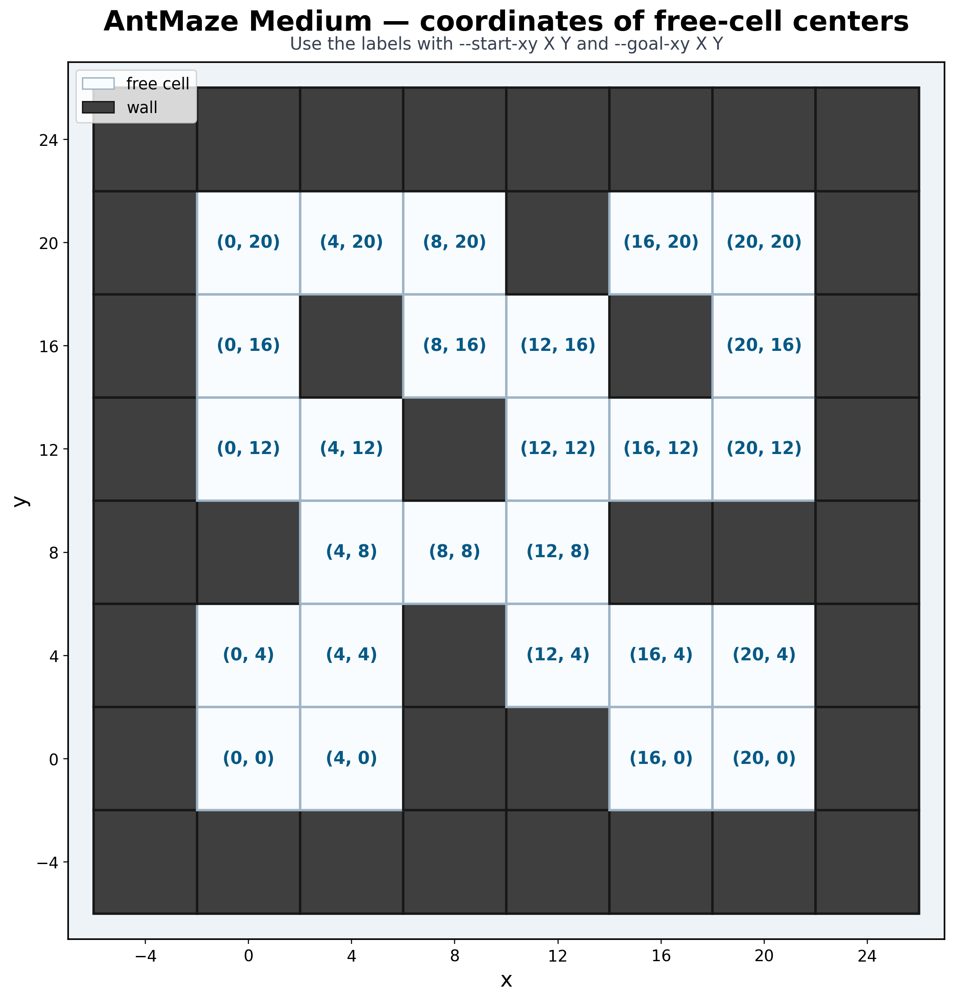

# Планирование нескольких намерений поверх замороженных FB-представлений

Репозиторий содержит решение исследовательского задания T-Lab: исходный агент FB π-Switch, планировщики нескольких подцелей, диагностические методы и инструменты объективного сравнения в лабиринте `ogbench-antmaze-medium-navigate-v0`.

## Суть работы

Робот-муравей должен пройти лабиринт и достичь заданной точки. Исходный агент каждый раз выбирает одно намерение — направление поведения, которое исполняет низкоуровневая политика. Новые планировщики оценивают маршрут через несколько промежуточных целей, исполняют первое намерение и затем пересчитывают маршрут из фактического состояния робота.

**Математика в трёх предложениях.** Ценность намерения приближённо оценивается как `V(s, z; z_r) ≈ ⟨F(s, z), z_r⟩`, где `s` — состояние, `z` — намерение, а `z_r` — фиксированное представление конечной задачи. Для офлайн-состояния `w` строится намерение `z_w = normalize(B(w))`, а коэффициент `η` оценивает достижимость подцели. Оценка маршрута складывает ценность первого намерения и поправки за переключение на последующие намерения.

Сети `F`, `B`, исходная высокоуровневая политика и низкоуровневая политика остаются замороженными. Вспомогательные энкодеры и декодеры обучаются исключительно по имеющимся офлайн-данным; генеративная модель среды и модель траекторий не используются. Подробности: [теория, обозначения и ограничения](docs/THEORY_AND_LIMITATIONS.md).

## Установка и проверка

Нужен 64-битный Python 3.11. Все команды выполняются из корня проекта.

Windows PowerShell:

```powershell
py -3.11 -m venv .venv
.\.venv\Scripts\Activate.ps1
python -m pip install --upgrade pip
python -m pip install -r requirements.txt
python -m pytest -q
```

Linux или Google Colab:

```bash
python3.11 -m venv .venv
source .venv/bin/activate
python -m pip install --upgrade pip
python -m pip install -r requirements.txt
python -m pytest -q
```

Для точного воспроизведения установленного окружения вместо `requirements.txt` используйте `requirements-lock.txt`. Первая команда создаёт изолированное окружение, вторая активирует его, третья обновляет установщик, четвёртая устанавливает зависимости, последняя запускает проверки.

Если видеопамяти мало, **до запуска Python** отключите резервирование JAX и при необходимости выберите процессор:

```powershell
$env:XLA_PYTHON_CLIENT_PREALLOCATE = "false"
$env:JAX_PLATFORMS = "cpu"
```

В Linux аналогичные настройки задаются командами `export XLA_PYTHON_CLIENT_PREALLOCATE=false` и `export JAX_PLATFORMS=cpu`.

Проверка чекпоинта и совпадения поведения исходного агента:

```powershell
python -m pytest -q tests/test_checkpoint.py tests/test_baseline_equivalence.py
```

В `checkpoints/antmaze-medium-navigate-v0/` уже находятся `flags.json` с настройками и `params.pkl` с готовыми весами.

## Структура проекта

| Каталог | Назначение |
| --- | --- |
| `agents/` | Исходные обучаемые агенты официального проекта. |
| `baseline/` | Загрузка замороженного агента и построение представления задачи. |
| `controllers/` | Контроллеры, выбирающие намерение на текущем шаге. |
| `hypotheses/` | Отдельные планировщики и исследовательские гипотезы. |
| `evaluation/` | Общий запуск эпизодов, сохранение результатов и парное сравнение. |
| `probes/` | Вспомогательные модели, в том числе декодер намерений в координаты. |
| `scripts/` | Команды запуска, обучения вспомогательных моделей и анализа. |
| `tests/` | Проверки формул, совместимости и воспроизводимости. |
| `artifacts/` | Обученные вспомогательные модели и результаты экспериментов. |
| `checkpoints/` | Готовый замороженный чекпоинт FB π-Switch. |
| `docs/` | Русскоязычные инструкции и подробные объяснения методов. |

Все методы используют единый `EpisodeRunner`: начальные состояния, критерий успеха, ограничение шагов и формат сохранения результатов не меняются от метода к методу.

## Координаты лабиринта и постановка задачи

| Задача | Начало `(x, y)` | Цель `(x, y)` |
| ---: | ---: | ---: |
| 1 | `(0, 0)` | `(20, 20)` |
| 2 | `(0, 20)` | `(20, 0)` |
| 3 | `(8, 16)` | `(4, 12)` |
| 4 | `(16, 20)` | `(0, 20)` |
| 5 | `(20, 4)` | `(0, 0)` |

Параметр `--task-id 1` выбирает первую официальную задачу. Собственный сценарий задаётся парой `--start-xy X Y --goal-xy X Y`; одновременно использовать `--task-id` и собственные координаты нельзя.



На карте показаны реальные положения свободных клеток. Начало и цель должны быть именно их центрами:

| `y` | Допустимые `x` |
| ---: | --- |
| 0 | 0, 4, 16, 20 |
| 4 | 0, 4, 12, 16, 20 |
| 8 | 4, 8, 12 |
| 12 | 0, 4, 12, 16, 20 |
| 16 | 0, 8, 12, 20 |
| 20 | 0, 4, 8, 16, 20 |

Пример маршрута из `(0, 0)` в `(4, 4)`:

```powershell
python -m scripts.run_baseline `
  --controller baseline `
  --start-xy 0 0 `
  --goal-xy 4 4 `
  --environment-seed 0 `
  --controller-seed 0 `
  --temperature 0 `
  --results-dir results_custom_baseline
```

OGBench добавляет к стартовой точке случайное смещение до `±1` по каждой координате; сама цель остаётся неизменной. Для собственной цели используются существующие первые 100 000 офлайн-состояний, а новые данные для обучения не собираются.

## Общие параметры запуска

| Параметр | Объяснение |
| --- | --- |
| `--checkpoint` | Каталог готового замороженного агента. |
| `--task-id` / `--task-ids` | Одна официальная задача или список задач. |
| `--start-xy` / `--goal-xy` | Собственные координаты начала и цели. |
| `--environment-seed` | Воспроизводимое начальное состояние среды. |
| `--controller-seed` | Воспроизводимая случайность контроллера. |
| `--seeds` | Несколько инициализаций среды для группового прогона. |
| `--temperature 0` | Детерминированный выбор действия политикой. |
| `--results-dir` | Каталог результатов эпизодов. |
| `--output-dir` | Каталог моделей, таблиц и графиков. |
| `--device cpu` | Вычисления JAX на процессоре. |

Подробный справочник **всех** параметров: [docs/CLI_PARAMETERS.md](docs/CLI_PARAMETERS.md). Для честного сравнения должны совпадать оба числа случайности. У 4D-планировщика `--controller-seed` необходимо задавать явно, если исходный агент использует `--controller-seed 0`.

## Исходный агент

```powershell
python -m scripts.run_baseline `
  --controller baseline `
  --task-id 1 `
  --environment-seed 0 `
  --controller-seed 0 `
  --temperature 0 `
  --results-dir results_baseline
```

`--controller baseline` включает предоставленную высокоуровневую политику. Вариант `--controller direct` подаёт конечное намерение напрямую; это дополнительная диагностика, а не основной исходный метод.

Предварительная серия из пяти задач и пяти инициализаций:

```powershell
python -m scripts.evaluate_baseline `
  --tasks 1 2 3 4 5 `
  --seeds 0 1 2 3 4 `
  --controller-seed 0 `
  --temperature 0 `
  --results-dir results_baseline `
  --log-file results_baseline/evaluation_commands.json
```

`--tasks` задаёт список задач, `--seeds` — список инициализаций, а `--log-file` сохраняет команды эксперимента. Итоговый протокол использует уже 21 инициализацию на каждую задачу.

## H0: две промежуточные цели

```powershell
python -m scripts.run_h0 `
  --task-id 1 `
  --environment-seed 0 `
  --controller-seed 0 `
  --temperature 0 `
  --max-candidates 64 `
  --pair-batch-size 4096 `
  --h0-replan-interval 1 `
  --results-dir results_h0
```

`--max-candidates 64` означает до `64² = 4096` пар состояний; `--pair-batch-size` ограничивает число пар в одном вычислительном блоке, а `--h0-replan-interval 1` пересчитывает план после каждого шага. На текущем шаге исполняется только первая подцель. Подробности: [docs/H0.md](docs/H0.md).

H0-B сравнивает маршруты через одну и две точки и использует те же параметры:

```powershell
python -m scripts.run_h0b `
  --task-id 1 `
  --environment-seed 0 `
  --controller-seed 0 `
  --temperature 0 `
  --max-candidates 64 `
  --pair-batch-size 4096 `
  --h0-replan-interval 1 `
  --results-dir results_h0b
```

Подробности: [docs/H0B.md](docs/H0B.md).

## H0 Local Terminal: локальная подцель и отдельный режим финиша

```powershell
python -m scripts.run_h0_local_terminal `
  --task-id 4 `
  --environment-seed 0 `
  --controller-seed 0 `
  --temperature 0 `
  --candidates-per-cell 10 `
  --grid-cell-size 4 `
  --local-radius 5 `
  --max-local-candidates 32 `
  --finish-radius 2 `
  --finish-mode direct `
  --direct-latent-mode raw `
  --pair-batch-size 512 `
  --results-dir results_h0_local_terminal
```

`--candidates-per-cell` ограничивает число состояний одной клетки размером `--grid-cell-size`. Первая подцель ищется в пределах `--local-radius`; учитывается не более `--max-local-candidates` состояний. На расстоянии `--finish-radius` включается режим `--finish-mode`: `direct` ведёт напрямую к цели, `baseline` возвращает исходный контроллер. `--direct-latent-mode raw` сохраняет исходное целевое представление, `normalized` включает его нормализацию.

Дополнительные параметры показывает команда `python -m scripts.run_h0_local_terminal --help-local`. Подробности: [docs/H0_LOCAL_TERMINAL.md](docs/H0_LOCAL_TERMINAL.md).

## H-goal-EuR: выбор состояния около цели

```powershell
python -m scripts.run_h_goal_eur `
  --variant dataset-max-v `
  --task-id 1 `
  --environment-seed 0 `
  --controller-seed 0 `
  --temperature 0 `
  --hge-candidate-radius 0.5 `
  --hge-max-candidates 64 `
  --hge-disagreement-penalty 0.5 `
  --results-dir results_h_goal_eur
```

`dataset-max-v` выбирает реальное состояние около цели по оценке критика; вариант `synthetic-current` подставляет координаты цели в текущее состояние робота. Остальные параметры задают радиус поиска, число кандидатов и штраф за несогласие оценщиков. Метод диагностирует финиш, но сам по себе не планирует последовательность подцелей. Подробности: [docs/H_GOAL_EUR.md](docs/H_GOAL_EUR.md).

## Проекция декодированной подцели

```powershell
python -m scripts.run_decoded_dataset_subgoal `
  --decoder artifacts/intention_xy_decoder_deep `
  --task-id 1 `
  --environment-seed 0 `
  --controller-seed 0 `
  --temperature 0 `
  --candidate-radius 0.5 `
  --max-candidates 64 `
  --disagreement-penalty 0.5 `
  --selection-mode max-v `
  --finish-mode task-latent `
  --replan-interval 1 `
  --results-dir results_decoded_dataset_subgoal
```

`--decoder` переводит намерение в координаты; в радиусе `--candidate-radius` рассматривается до `--max-candidates` реальных состояний. `--selection-mode max-v` выбирает лучшее состояние по FB-оценке, а `nearest-xy` — геометрически ближайшее. `--disagreement-penalty` уменьшает оценку при расхождении участников ансамбля.

Режимы `--finish-mode`:

- `task-latent`: исходное представление конечной задачи фиксировано;
- `fixed-v-max`: полное состояние около цели выбирается один раз;
- `dynamic-v-max`: полное состояние около цели перевыбирается при каждом перепланировании.

Координаты цели при этом остаются неизменными. `--replan-interval 1` означает пересчёт на каждом шаге; значение по умолчанию в коде равно `5`. Подробности: [docs/DECODED_DATASET_SUBGOAL.md](docs/DECODED_DATASET_SUBGOAL.md).

## Три динамические подцели в четырёхмерном пространстве

```powershell
python -m scripts.run_latent_three_dynamic `
  --device cpu `
  --model-dir artifacts/latent_three_dynamic `
  --task-id 4 `
  --environment-seed 0 `
  --controller-seed 0 `
  --intention-mode decoded `
  --max-candidates 256 `
  --rerank-count 16 `
  --replan-interval 10 `
  --results-dir results_latent_three_dynamic
```

`--model-dir` содержит готовые энкодер и декодер, `--max-candidates` ограничивает число возможных точек, `--replan-interval 10` пересчитывает маршрут каждые десять шагов. `--rerank-count 16` означает повторную проверку не более 16 лучших вариантов исходным FB-критиком; это не количество подцелей — промежуточных точек всегда три.

`--intention-mode decoded` восстанавливает намерение обученным декодером. Для отдельной проверки без этой ошибки укажите `--intention-mode exact-b`: намерение будет построено напрямую через `normalize(B(w))`. Подробности: [docs/LATENT_THREE_DYNAMIC.md](docs/LATENT_THREE_DYNAMIC.md).

## Обучение вспомогательных моделей

Декодер намерения в физические координаты:

```powershell
python -m scripts.train_intention_xy_decoder `
  --checkpoint checkpoints/antmaze-medium-navigate-v0 `
  --output-dir artifacts/intention_xy_decoder_deep `
  --max-samples 300000 `
  --hidden-dims 512 512 512 `
  --max-epochs 500
```

`--max-samples` задаёт число офлайн-состояний, `--hidden-dims` — размеры скрытых слоёв, `--max-epochs` — предел числа проходов обучения. Подробности: [docs/INTENTION_XY.md](docs/INTENTION_XY.md).

Четырёхмерная модель ценности и декодер намерений:

```powershell
python -m scripts.train_latent_three_dynamic `
  --device cpu `
  --max-states 40000 `
  --train-pairs 80000 `
  --goal-count 256 `
  --teacher-batch-size 128 `
  --epochs 60 `
  --decoder-epochs 80 `
  --output-dir artifacts/latent_three_dynamic
```

Параметры задают число исходных состояний, обучающих пар, различных целей, размер блока запросов к замороженному критику, число проходов обучения энкодера и отдельно декодера.

## Дополнительная диагностика

Проверка, насколько ценность определяется физическими координатами:

```powershell
python -m scripts.run_value_geometry `
  --device cpu `
  --target-mode xy-goal `
  --max-states 18000 `
  --train-pairs 20000 `
  --models xy full latent2 latent4 `
  --model-seeds 0 1 2 `
  --output-dir artifacts/value_geometry_main
```

`--target-mode` задаёт тип конечной задачи, `--models` выбирает модели по одним координатам, полному состоянию и сжатым пространствам, `--model-seeds` задаёт независимые инициализации. Быстрая проверка без чекпоинта: `python -m scripts.run_value_geometry --synthetic --quick --no-plots`; повторное использование уже оценённых пар включается ключом `--resume`. Подробности: [docs/VALUE_GEOMETRY.md](docs/VALUE_GEOMETRY.md).

Поправки на позу и скорость начального и конечного состояния:

```powershell
python -m scripts.run_value_state_factors `
  --device cpu `
  --max-states 80000 `
  --train-pairs 160000 `
  --goal-count 384 `
  --models xy xy_start xy_goal xy_both xy_additive full `
  --model-seeds 0 1 2 `
  --epochs 100 `
  --output-dir artifacts/value_state_factors
```

`xy_start` добавляет поправку на старт, `xy_goal` — на цель, `xy_both` — обе, а `xy_additive` проверяет сложение вместо умножения. Подробности: [docs/VALUE_STATE_FACTORS.md](docs/VALUE_STATE_FACTORS.md).

Визуализация сохранённых намерений:

```powershell
python -m scripts.plot_rollout_intentions `
  --trajectory ПУТЬ_К_ЭПИЗОДУ/trajectory.npz `
  --decoder artifacts/intention_xy_decoder_deep `
  --step-size 10
```

`--trajectory` указывает сохранённый эпизод, а `--step-size 10` рисует каждое десятое намерение. Диагностика попадания в цель:

```powershell
python -m scripts.diagnose_goal_capture `
  --source-results results_baseline `
  --goal-xy 4 4 `
  --goal-state-count 8 `
  --horizon 100 `
  --output-dir results_goal_capture
```

`--source-results` выбирает исходные эпизоды, `--goal-state-count` ограничивает число целевых состояний, `--horizon` — длину каждого продолжения. Подробности: [docs/GOAL_CAPTURE.md](docs/GOAL_CAPTURE.md).

## Полный прогон: пять задач и 21 инициализация

Готовый PowerShell-скрипт запускает исходный метод и проекцию подцели:

```powershell
.\scripts\run_full_benchmark.ps1
```

`-ResultsRoot` задаёт общий каталог результатов, `-Tasks` — список задач, `-Seeds` — список инициализаций, `-Python` — путь к Python. `-SkipBaseline` и `-SkipDeepProjection` пропускают соответствующую часть прогона.

Полный эксперимент динамического 4D-планировщика:

```powershell
python -m scripts.run_latent_three_dynamic `
  --device cpu `
  --model-dir artifacts/latent_three_dynamic `
  --task-ids 1 2 3 4 5 `
  --seeds 0 1 2 3 4 5 6 7 8 9 10 11 12 13 14 15 16 17 18 19 20 `
  --controller-seed 0 `
  --compare-baseline `
  --intention-mode both `
  --max-candidates 256 `
  --rerank-count 16 `
  --replan-interval 10 `
  --results-dir results_latent_three_dynamic
```

`--compare-baseline` добавляет исходный метод; `--intention-mode both` запускает `decoded` и `exact-b`. Итого получается 315 эпизодов: по 105 на каждый метод.

## Агрегация и честное сравнение

Агрегация результатов одного метода:

```powershell
python -m scripts.evaluate_results --results-dir results_baseline
```

Парное сравнение:

```powershell
python -m scripts.paired_analysis `
  --baseline-dir results_baseline `
  --candidate-dir results_candidate `
  --output comparisons/candidate_vs_baseline.json `
  --bootstrap-seed 0 `
  --bootstrap-samples 10000
```

`--baseline-dir` и `--candidate-dir` задают сравниваемые каталоги, `--output` — итоговый JSON-файл, `--bootstrap-samples` — число повторных статистических выборок, `--bootstrap-seed` — их фиксированную случайность.

Главная метрика — доля успешных эпизодов на одинаковых сценариях. Шаги и длину маршрута следует сравнивать только на задачах, которые успешно завершили оба метода. Повторные запуски того же сценария нельзя учитывать как независимые наблюдения. Подробности: [docs/BASELINE_METRICS.md](docs/BASELINE_METRICS.md).

## Тесты и частые ошибки

Полный набор: `python -m pytest -q`. Проверки без полного окружения:

```powershell
python -m unittest tests.test_value_geometry -v
python -m unittest tests.test_value_state_factors -v
python -m unittest tests.test_latent_three_dynamic -v
```

- Не найден декодер: явно передайте `--decoder artifacts/intention_xy_decoder_deep`.
- Не хватает памяти: уменьшите размер блока и число кандидатов либо выберите процессор.
- Координаты отклонены: проверьте карту свободных клеток и не сочетайте их с `--task-id`.
- Парный анализ не сопоставляет эпизоды: проверьте `environment_seed` и `controller_seed`.
- `WinError 4551`: библиотеку MuJoCo блокирует системная политика Windows; нужно разрешённое окружение.

## Подробная документация

- [Теория и ограничения](docs/THEORY_AND_LIMITATIONS.md).
- [Все параметры команд](docs/CLI_PARAMETERS.md).
- [H0: две подцели](docs/H0.md) и [интеграция H0](docs/H0_INTEGRATION.md).
- [H0-B: выбор глубины](docs/H0B.md).
- [Локальный H0 и режим финиша](docs/H0_LOCAL_TERMINAL.md).
- [Выбор состояния около цели](docs/H_GOAL_EUR.md).
- [Проекция декодированной подцели](docs/DECODED_DATASET_SUBGOAL.md).
- [Три динамические подцели в 4D](docs/LATENT_THREE_DYNAMIC.md).
- [Декодер намерения в координаты](docs/INTENTION_XY.md).
- [Геометрия оценки ценности](docs/VALUE_GEOMETRY.md).
- [Поправки на состояние робота](docs/VALUE_STATE_FACTORS.md).
- [Диагностика точного попадания в цель](docs/GOAL_CAPTURE.md).
- [Честные метрики сравнения](docs/BASELINE_METRICS.md).
- [Исходное обучение агентов](docs/UPSTREAM_TRAINING.md).
- [Аудит качества кода](docs/CODE_QUALITY_AUDIT.md).
