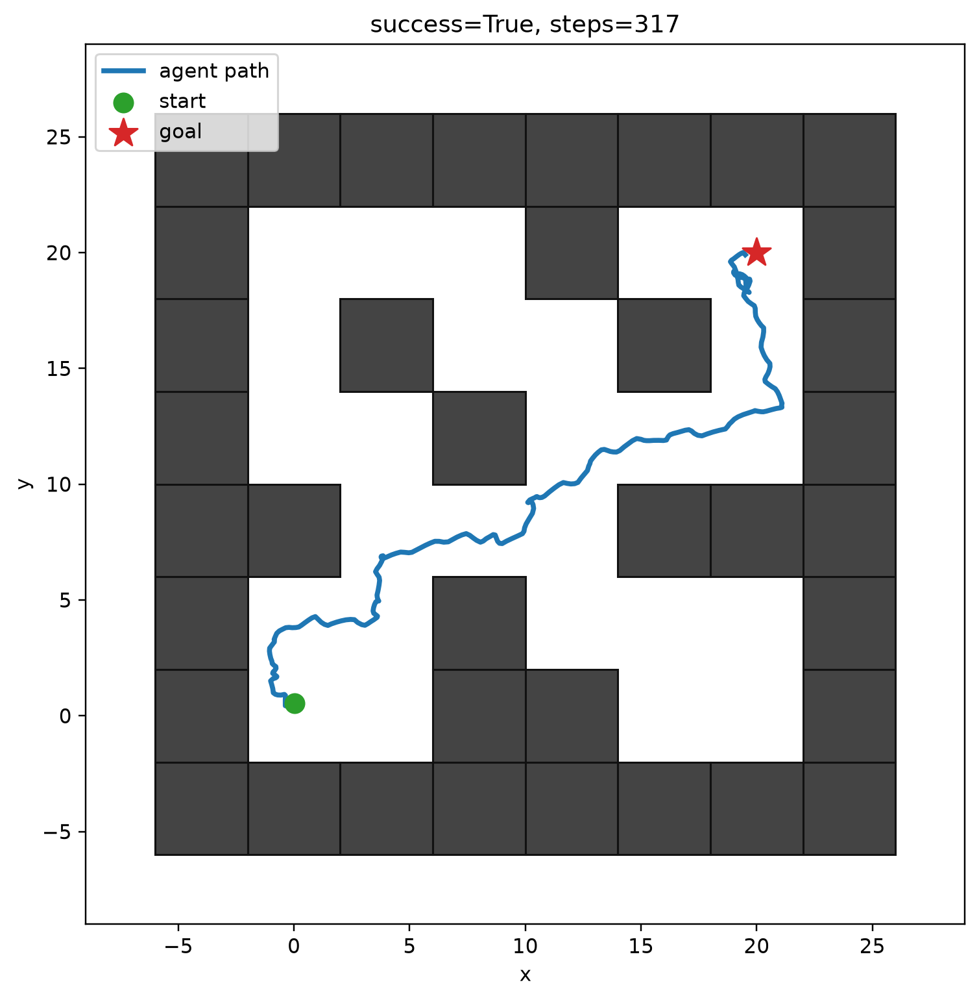

# Планирование поверх Forward–Backward-представлений: исследование подцелей, поведения агента и геометрии пространства состояний

## Коротко о результате

В работе я исследовал, можно ли улучшить предоставленный FB π-Switch контроллер за счёт планирования нескольких подцелей, не обучая модель мира и не собирая новые данные для обучения. В качестве основной среды использовалась `antmaze-medium-navigate-v0`, а представления `F`, `B` и низкоуровневая политика оставались замороженными.

Первый прямой подход — аналитически оценивать последовательность из двух подцелей — не улучшил результат. Наоборот, он показал 44% успешных эпизодов против 84% у baseline в предварительном эксперименте. После этого я сменил порядок рассуждений: сначала разобрался, как именно ломается исходный агент, и только потом начал проектировать более сложные методы.

Анализ траекторий показал две разные проблемы: агент может проходить рядом с целью и уходить в петлю либо почти полностью переставать двигаться. Оказалось, что для муравья важны не только глобальные маршруты, но и то, в каком полном физическом состоянии он пытается попасть в подцель. Это привело к вспомогательному декодеру интенций в координаты (x, y), выбору более подходящих состояний из офлайн-датасета и исследованию низкоразмерных представлений состояний. 

Лучший практический вариант сохранил исходную конечную задачу и уточнял только промежуточную подцель. В основном эксперименте он достиг цели в 88 из 105 эпизодов против 85 из 105 у baseline. Разница положительная, но статистически неубедительная. Явное планирование трёх подцелей в четырёхмерном пространстве оказалось хуже baseline: 59 и 62 успеха из 105 в двух вариантах реализации.

Поэтому основной вывод работы такой: **на лабиринте medium не удалось убедительно показать, что само добавление нескольких подцелей улучшает управление. Зато удалось локализовать реальные проблемы baseline, построить воспроизводимый экспериментальный стенд, улучшить выбор промежуточных состояний и проверить несколько способов организации пространства планирования.** Проверка этих же методов на более крупных лабиринтах остаётся важным следующим шагом: там длинный горизонт может стать основным ограничением, но времени на этот эксперимент мне не хватило.



---

## 1. Постановка задачи и ограничения

В исходной задаче уже есть обученный агент, который умеет выполнять разные навигационные задачи без нового обучения. Агент состоит из нескольких частей:

- `F` и `B` — обученные представления, позволяющие оценивать будущее поведение;
- низкоуровневая политика — сеть, которая по текущему состоянию и интенции выбирает действия робота;
- высокоуровневая политика — сеть, которая по состоянию и конечной задаче выбирает следующую интенцию.

Интенцию здесь удобно понимать как компактное описание того, какое поведение агент должен выполнять дальше. Это не обязательно конкретная координата. Одна и та же точка на карте может соответствовать разным интенциям, потому что муравей может приходить к ней с разной скоростью, ориентацией корпуса и положением ног.

Цель задания — построить высокоуровневый механизм, который рассуждает не только об одной ближайшей интенции, но и о последовательности интенций. При этом действуют три ограничения:

1. Не обучать генеративную модель мира или модель полных траекторий.
2. Не собирать новые переходы среды для обучения планировщика.
3. По возможности оставить `F`, `B` и низкоуровневую политику замороженными.

Во всех основных методах эти ограничения соблюдаются. Вспомогательные сети обучаются только на имеющемся офлайн-датасете и предсказаниях замороженного критика. Взаимодействие со средой используется только для итоговой проверки контроллеров, а не для обучения.

### 1.1. Что именно является задачей в AntMaze

Состояние робота содержит 29 компонент:

$$
s \in \mathbb{R}^{29}.
$$

Первые две компоненты описывают пространственное положение. Остальные связаны с конфигурацией тела, положением суставов, скоростями и другими параметрами состояния.

Действие имеет размерность восемь:

$$
a \in \mathbb{R}^{8}.
$$

Размерность пространства интенций в предоставленном чекпоинте равна 128:

$$
z \in \mathbb{R}^{128}.
$$

Конечная задача задаётся пространственной целью

$$
g_{xy}=(x_g,y_g).
$$

Эпизод считается успешным, если робот входит в область цели радиуса 0.5. Предельная длина эпизода — 1000 шагов. Коэффициент дисконтирования в предоставленном чекпоинте:

$$
\gamma=0.99.
$$

Важно различать пространственную цель и конкретное полное состояние около неё. Задача требует прийти в область `(x, y)`, но низкоуровневая политика может по-разному реагировать на разные представления физических состояний, расположенных внутри одной и той же области.

---

## 2. Теория: что именно оценивают F и B

### 2.1. Физический смысл

Прежде чем придумывать новые методы, я разбирался, что именно хотят авторы задания и какую информацию уже содержит предоставленный агент.

Обычная функция ценности отвечает на вопрос: насколько хорошо сейчас действовать определённым образом, если в будущем нужно получить некоторую награду? Для навигации это означает: насколько перспективно выбранное поведение, если конечная цель находится в заданной области лабиринта.

Мера будущих посещений отвечает на более общий вопрос: какие состояния агент будет посещать в будущем, если начнёт действовать по некоторой политике? Если эта информация известна, то для каждой новой награды можно отдельно оценить, насколько полезными окажутся такие будущие посещения.

### 2.2. Мера будущих посещений

В упрощённой дискретной записи для политики $\pi$:

$$
M_s^{\pi}(s')
=
\mathbb{E}_{\pi}
\left[
\sum_{t=0}^{\infty}
\gamma^t
\mathbf{1}\{s_t=s'\}
\;\middle|\;
s_0=s
\right].
$$

Эта величина показывает, насколько часто и насколько скоро агент окажется в состоянии $s'$. Для непрерывного пространства состояний требуется более аккуратная запись через меры или плотности; индикаторная формула выше используется только для интуиции.

Если награда зависит от состояния, ценность политики выражается через будущие посещения:

$$
V^{\pi}(s;r)
=
\int r(s')\,M_s^{\pi}(\mathrm{d}s').
$$

В исходной работе Touati и Ollivier рассматриваются также представления, зависящие от состояния и действия. В статье про Switching Successor Measures используется версия, где действие усреднено по политике. Именно такая форма ближе к предоставленной реализации:

$$
\widehat V_e(s;z_{\pi},z_r)
=
F_e(s,z_{\pi})^\top z_r.
$$

Здесь:

- $z_{\pi}$ задаёт поведение, которое оценивается;
- $z_r$ задаёт конечную задачу;
- $e$ обозначает один из двух экземпляров сети `F`.

Это важное разделение. Интенция политики и представление награды играют разные роли и не должны смешиваться только потому, что обе величины имеют размерность 128.

Равенство выше определяет вычисляемую модельную оценку. Связь этой оценки с настоящей ценностью среды является приближённой:

$$
V^{\pi_{z_{\pi}}}(s;r)
\approx
\widehat V(s;z_{\pi},z_r).
$$

Поэтому максимизация предсказания сети сама по себе не гарантирует улучшения реального поведения робота.

### 2.3. Как работает исходный baseline

Представление конечной задачи строится по размеченным состояниям офлайн-датасета. В экспериментальном стенде сохранён исходный путь `infer_latent`: используются первые 100 000 состояний предусмотренной выборки, исходная разметка награды и исходная нормализация.

После этого на каждом шаге высокоуровневая политика предлагает интенцию:

$$
z_h
\sim
\pi_{\mathrm{high}}(\cdot\mid s,z_g).
$$

Эта интенция нормализуется и передаётся низкоуровневой политике:

$$
a
\sim
\pi_{\mathrm{low}}
\left(
\cdot\mid s,\operatorname{normalize}(z_h)
\right).
$$

Нормализация в официальном коде приводит вектор не к единичной длине, а примерно к длине $\sqrt{128}$:

$$
\operatorname{normalize}(z)
=
\frac{z}{\lVert z\rVert_2+10^{-8}}
\sqrt{128}.
$$

Это небольшая техническая деталь, но её важно сохранить: передача в политику вектора другого масштаба меняет условия, в которых она обучалась.

---

## 3. Экспериментальный стенд

После изучения теории я разработал экспериментальный стенд. Основным требованием было разделить аппаратную часть и исследовательскую.

Под аппаратной частью я имею в виду всё, что должно оставаться одинаковым между экспериментами: загрузку чекпоинта, создание среды, начальное состояние, построение представления задачи, работу низкоуровневой политики и сохранение результатов.

Исследовательская часть — это отдельный контроллер или планировщик, который выбирает следующую интенцию. Новую гипотезу можно добавить отдельными файлами, не переписывая запуск среды и не меняя внутреннее поведение уже существующих контроллеров.

Такое разделение было важно по двум причинам. Во-первых, иначе легко случайно улучшить метрики не новым методом, а изменением начального состояния или конечной задачи. Во-вторых, последовательная разработка гипотез быстро становится неуправляемой, если каждая новая идея требует вмешательства в предыдущий код.

Стенд включает:

- загрузку исходных `F`, `B`, высокоуровневой и низкоуровневой политик;
- воспроизведение исходного построения представления задачи;
- общий интерфейс высокоуровневых контроллеров;
- отдельные параметры случайности среды и контроллера;
- запуск официальных задач и дополнительных пользовательских сценариев;
- сохранение координат, действий, полных состояний, интенций и диагностических показателей;
- визуализацию траекторий на карте;
- агрегацию результатов по задачам;
- парное сравнение методов на одинаковых сценариях.

Для baseline предусмотрена отдельная проверка эквивалентности: при температуре ноль действие, полученное через экспериментальный стенд, сравнивается с действием исходного `sample_actions` из репозитория авторов.

Важное ограничение: некоторые экспериментальные методы сравниваются только после полного совпадения сценария, задачи, параметра случайности среды и параметра случайности контроллера. Если такое совпадение нарушено, я отдельно отмечаю это в разделе с результатами.

-1.png)

---

## 4. Первая гипотеза: аналитическое планирование двух подцелей

### 4.1. Идея переключения

Статья про Switching Successor Measures показывает, как оценить поведение агента, который сначала движется к промежуточному состоянию $w$, а после его достижения переключается на политику конечной задачи.

Для настоящих мер будущих посещений в статье получено точное соотношение:

$$
M_s^{\pi_w\rightarrow\pi}(s')
=
M_s^{\pi_w}(s')
+
\frac{M_s^{\pi_w}(w)}{M_w^{\pi_w}(w)}
\left[
M_w^{\pi}(s')
-
M_w^{\pi_w}(s')
\right].
$$

Обозначим коэффициент:

$$
\eta(s,w)
=
\frac{M_s^{\pi_w}(w)}{M_w^{\pi_w}(w)}.
$$

Интуитивно он учитывает, насколько реально и насколько скоро дойти из текущего состояния до выбранной подцели. Для обученной модели это уже не точная величина, а оценка:

$$
\widehat\eta(s,w)
=
\frac{
\overline F(s,z_w)^\top z_w
}{
\overline F(w,z_w)^\top z_w
},
\qquad
z_w=\operatorname{normalize}(B(w)),
$$

где $\overline F$ — среднее двух экземпляров сети `F`.

Если знаменатель слишком мал или значение не является конечным, кандидат исключается. Остальные оценки ограничиваются интервалом $[0,1]$.

Для одной подцели оценка плана принимает вид:

$$
\widehat J_1(s,w;z_g)
=
\widehat V(s;z_w,z_g)
+
\widehat\eta(s,w)
\left[
\widehat V(w;z_g^{\pi},z_g)
-
\widehat V(w;z_w,z_g)
\right],
$$

где $z_g^{\pi}$ — представление конечной задачи, приведённое к формату интенции политики.

Первое слагаемое описывает поведение при движении к подцели. Второе учитывает, что после попадания в неё политика меняется и начинает работать уже на конечную задачу.

### 4.2. Метод H0

Затем эта идея была распространена на две промежуточные точки:

$$
s\rightarrow w_1\rightarrow w_2\rightarrow g.
$$

Если обозначить

$$
z_1=\operatorname{normalize}(B(w_1)),
\qquad
z_2=\operatorname{normalize}(B(w_2)),
$$

то двухступенчатая оценка имеет вид:

$$
\begin{aligned}
\widehat J_2(s,w_1,w_2;z_g)
={}&
\widehat V(s;z_1,z_g)
\\
&+
\widehat\eta(s,w_1)
\left[
\widehat V(w_1;z_2,z_g)
-
\widehat V(w_1;z_1,z_g)
\right]
\\
&+
\widehat\eta(s,w_1)
\widehat\eta(w_1,w_2)
\left[
\widehat V(w_2;z_g^{\pi},z_g)
-
\widehat V(w_2;z_2,z_g)
\right].
\end{aligned}
$$

Метод перебирает пары состояний из офлайн-датасета и выбирает пару с максимальной оценкой. В исходной конфигурации используется 64 состояния, то есть оценивается

$$
64^2=4096
$$

пар.
Это очевидно мало, выбрано в целях экономии времени.
Затем исполняется только первая подцель. На следующем шаге или после заданного интервала план строится заново. Это именно перепланирование, а не жёсткое прохождение заранее записанного маршрута.

### 4.3. Важное расхождение статьи и кода

В статье преимущество переключения содержит вычитание ценности старой политики после достижения подцели:

$$
A_{\mathrm{paper}}
=
V^{\pi_w}(s;r)
+
\eta
\left[
V^{\pi}(w;r)
-
V^{\pi_w}(w;r)
\right]
-
V^{\pi}(s;r).
$$

В приложенном официальном коде высокоуровневой политики расчёт записан иначе:

```python
adv = Vswr + Msww / Mwww * Vwrr - Vrstar
```

То есть явно отсутствует слагаемое

$$
-\eta V^{\pi_w}(w;r).
$$

Это фактическое отличие между формулой статьи и предоставленным кодом. Из него нельзя сказать, что найден источник всех проблем baseline: история обучения чекпоинта и влияние расхождения отдельно не проверялись. 

В собственном методе $H_0$ использовалась формула с явной поправкой на переключение. Это ещё один задел на будущее исследование. Возможно без поправки будет лучше.

### 4.4. Первый результат

Предварительный эксперимент проводился на пяти официальных задачах и пяти параметрах случайности среды:

| Метод | Успехи | Доля успешных эпизодов |
|---|---:|---:|
| baseline | 21/25 | 84% |
| $H_0$ | 11/25 | 44% |
| $H_{0B}$ | 11/25 | 44% |

$H_{0B}$ дополнительно выбирал между планированием одной и двух подцелей. Однако на всех 25 сценариях $H_0$ и $H_{0B}$ совпали не только по успеху, но и по числу шагов, длине пути и конечному расстоянию. Поэтому эти результаты нельзя считать двумя независимыми подтверждениями одной идеи.

Парное сравнение $H_0$ с baseline даёт:

$$
\Delta_{\mathrm{success}}=-40\text{ п.п.},
\qquad
p_{\mathrm{McNemar}}=0.0129.
$$

Те попытка добавить планирование сделала агента заметно хуже. Тут возможно придумать много причин, и первое, что приходит в голову это член $$\widehat\eta(s,w_1)
\widehat\eta(w_1,w_2)$$ 
В нем может накапливаться существенная ошибка аппроксимации. Это интересное ответвление исследования. Но я пошёл в другую ветку: судя по тому, как ходит baseline в львиной доле неудачных случаев, кажется, что стоит обратить внимание вот на что:
**а точно ли исходному агенту не хватает именно длинной последовательности подцелей?**

---

## 5. Анализ поведения baseline

### 5.1. Что видно на траекториях

После неудачи $H_0$ я начал смотреть не только на итоговую долю успехов, но и на отдельные траектории муравья.

При визуальном анализе чаще всего встречались два сценария.

Первый: робот подходит близко к цели, но не заходит в область успеха. Вместо этого он меняет направление, уходит в сторону, иногда описывает большую петлю и может возвращаться к цели только через значительную часть лабиринта.

Второй: робот оказывается почти неподвижным. При увеличении масштаба видно, что координаты иногда продолжают меняться, но эти изменения на порядки меньше обычного перемещения за несколько шагов.

Первое поведение указывает на проблему точного завершения и выбора интенции рядом с целью. Второе может быть связано с падением, неудачной конфигурацией тела или устойчивым локальным режимом управления. По одним только координатам нельзя доказать, что муравей действительно упал, поэтому дальше я называю это наблюдение именно **потерей подвижности**, а физическую причину рассматриваю как гипотезу.

> **** Неуспешная траектория baseline, где муравей подходит к цели - seed 16

> **** Траектория с потерей подвижности - seed 7

### 5.2. Проверка наблюдений по сохранённым траекториям

Для основной серии baseline было 20 неуспешных эпизодов из 105.

Из них:

- в 7 эпизодах робот хотя бы один раз подходил к центру цели ближе чем на 1.0, но так и не завершал задачу;
- в 11 эпизодах длина движения за последние 100 сохранённых состояний была меньше 1.0;
- в 16 эпизодах финальная дистанция до цели превышала 5.0.

Эти группы могут пересекаться. Например, агент способен сначала подойти почти вплотную к цели, затем уйти и закончить эпизод далеко от неё.

Уже на этом этапе стало понятно, что объяснение «лабиринт сложный, поэтому нужно добавить ещё несколько промежуточных точек» слишком грубое. Часть проблем возникает около самой цели, а часть связана не с выбором глобального маршрута, а с тем, что агент перестаёт эффективно двигаться.

---

## 6. Диагностика короткого маршрута

### 6.1. Зачем понадобился отдельный сценарий

Чтобы отделить проблему планирования маршрута от проблемы точного завершения, я взял максимально простой сценарий:

$$
(0,0)\rightarrow(4,4).
$$

Старт и цель находятся в соседних свободных клетках. На этом маршруте нет длинной последовательности коридоров, поэтому большую петлю трудно объяснить необходимостью обходить сложную структуру лабиринта.

Сравнение проводилось на 30 одинаковых параметрах случайности среды.

### 6.2. Прямое управление низкоуровневой политикой

Первым диагностическим вмешательством был обход высокоуровневой политики. Вместо её промежуточной интенции низкоуровневая политика получала исходное представление конечной задачи:

$$
z_{\mathrm{direct}}
=
z_g,
$$

$$
a
\sim
\pi_{\mathrm{low}}(\cdot\mid s,z_{\mathrm{direct}}).
$$

В этой реализации дополнительная нормализация не выполняется: `TaskEncoder` уже получает нормализованное представление задачи из исходного `infer_latent`, а прямой контроллер передаёт его низкоуровневой политике без изменений.

Результат:

| Метод | Успехи | Общих успехов с baseline | Разница шагов на общих успехах |
|---|---:|---:|---:|
| baseline | 28/30 | — | — |
| Прямое управление | 28/30 | 26 | −112.4 |

Доля успехов не изменилась, но среди 26 эпизодов, где оба метода справились, прямое управление в среднем требовало примерно на 112 шагов меньше. Средняя длина пути уменьшилась на 16.8.

Это не означает, что прямое управление всегда лучше. На пяти официальных задачах в предварительном эксперименте оно показало 20/25 против 21/25 у baseline. Зато короткий сценарий показал, что высокоуровневая политика действительно способна заметно усложнять поведение даже там, где сложный маршрут не требуется.

### 6.3. Возможные объяснения

Первое объяснение связано с распределением офлайн-данных. Высокоуровневая политика могла лучше усвоить часто встречающиеся маршруты и продолжать предлагать привычные направления движения даже тогда, когда до цели уже проще идти напрямую. В отдельных визуализациях подозрительные подцели указывали в сторону центральной части карты.

Это именно качественное наблюдение: частота посещения центра и причинная связь с ошибками политики отдельно статистически не измерялись.

Второе объяснение связано с полным состоянием. Для человека задача выглядит как «дойти до координат `(x, y)`». Для низкоуровневой политики подцель включает только координаты, но и ориентацию, скорость и конфигурацию тела. Тогда две почти одинаковые пространственные цели способны порождать совершенно разное движение.

Например, если выбранное состояние цели соответствует входу с другой стороны, политика может сначала попытаться обойти точку, чтобы прийти к ней в знакомой конфигурации.

---

## 7. Декодер интенции в пространственные координаты

Чтобы понять, куда указывает высокоуровневая политика, я обучил вспомогательную сеть:

$$
D_{xy}:\mathbb{R}^{128}\rightarrow\mathbb{R}^2.
$$

Она обучалась на парах:

$$
\left(
\operatorname{normalize}(B(s)),
\operatorname{xy}(s)
\right),
$$

сформированных исключительно из офлайн-датасета.

Задача декодера:

$$
D_{xy}\left(\operatorname{normalize}(B(s))\right)
\approx
(x_s,y_s).
$$

Это не генеративная модель мира и не предсказание будущих состояний. Декодер только связывает уже существующую 128-мерную интенцию с примерной точкой на карте.

Для обучения и проверки использовалось разделение по целым траекториям, а не случайное перемешивание соседних состояний одной и той же траектории. Размеры выборок:

- обучение: 240 001 состояние;
- проверка при обучении: 30 000 состояний;
- итоговая проверка: 29 999 состояний.

Фактическая архитектура сохранённой сети:

$$
128\rightarrow256\rightarrow128\rightarrow2.
$$

Результаты:

| Выборка | RMSE по координатам | Средняя пространственная ошибка | Медианная ошибка | 90-й процентиль ошибки |
|---|---:|---:|---:|---:|
| Обучение | 0.474 | 0.547 | 0.463 | 1.027 |
| Валидация | 0.705 | 0.730 | 0.559 | 1.377 |
| Тест | 0.955 | 0.894 | 0.597 | 1.841 |

Декодер хорошо подходит для визуального анализа направления подцелей, но его нельзя считать точным прибором для завершения задачи: медианная ошибка на тестовой выборке уже больше радиуса успешного попадания 0.5. Но и интенции не являются точным указателем, скорее примерным направлением.

Кроме того, он обучался на интенциях вида $\operatorname{normalize}(B(s))$, а произвольный выход высокоуровневой политики может иметь немного другое распределение. Поэтому стрелка на карте — полезная диагностическая подсказка, но не доказательство точного смысла любой интенции.

> **** Траектория baseline со стрелками декодированных интенций через каждые 10 шагов.

---

## 8. Выбор полного состояния цели по FB-оценке

### 8.1. Идея

После анализа короткого маршрута появилась гипотеза: возможно, проблема не в самих координатах цели, а в том, какое именно полное состояние соответствует исполняемой интенции.

В офлайн-датасете обычно есть несколько разных состояний, расположенных около одной и той же пространственной точки. Робот в этих состояниях может быть развёрнут в разные стороны, двигаться с разной скоростью или находиться в разных фазах шага.

Пусть $p$ — интересующая пространственная точка. Сначала выбираются состояния датасета рядом с ней:

$$
\mathcal C(p)
=
\left\{
w_i\in\mathcal D_{\mathrm{offline}}
:
\lVert\operatorname{xy}(w_i)-p\rVert_2\le r
\right\}.
$$

Важно: этот радиус применяется к двум пространственным координатам, а не ко всем 29 компонентам состояния.

Для каждого кандидата строится интенция:

$$
z_i=\operatorname{normalize}(B(w_i)).
$$

Затем две сети `F` оценивают, насколько полезно исполнение этой интенции для исходной конечной задачи:

$$
v_e(s,w_i;z_g)
=
F_e(s,z_i)^\top z_g,
\qquad
e\in\{1,2\}.
$$

Для устойчивости используется штраф за расхождение двух оценок:

$$
S(s,w_i;z_g)
=
\frac{v_1+v_2}{2}
-
\lambda\lvert v_1-v_2\rvert.
$$

При $\lambda=0.5$ эта формула упрощается:

$$
S(s,w_i;z_g)
=
\min(v_1,v_2).
$$

Выбирается состояние с наибольшей консервативной оценкой:

$$
w^{\star}
=
\arg\max_{w_i\in\mathcal C(p)}
S(s,w_i;z_g).
$$

Физическая интуиция здесь простая: если для достижения одного состояния робот должен сначала сделать большую петлю, а другое состояние позволяет двигаться естественно и без лишнего разворота, то второе состояние должно быть предпочтительнее для исходной задачи.

Но это рассуждение зависит от качества замороженного критика. Оно объясняет мотивацию метода, а не доказывает, что максимальная модельная оценка обязательно соответствует самому короткому или устойчивому реальному маршруту.

### 8.2. Проверка на коротком маршруте

На сценарии `(0,0) → (4,4)` метод выбора состояния цели по максимальной оценке дал:

| Метод | Успехи | Общих успехов с baseline | Среднее изменение шагов | Среднее изменение длины пути |
|---|---:|---:|---:|---:|
| baseline | 28/30 | — | — | — |
| Прямое управление | 28/30 | 26 | −112.4 | −16.8 |
| Выбор состояния цели по максимуму $V$ | 29/30 | 27 | −149.2 | −23.3 |

Изменение доли успехов относительно baseline не является статистически значимым: точный критерий Мак-Немара даёт $p=1.0$. Тем не менее число шагов на общих успешных эпизодах уменьшилось, а доверительный интервал для этого изменения не включает ноль.

Это хорошо согласуется с гипотезой о лишних петлях. Однако результаты получены только для одной пары старта и цели, поэтому переносить их на весь benchmark без отдельной проверки нельзя.

### 8.3. Синтетическое состояние

Также проверялся более прямолинейный способ:

$$
\widetilde g
=
\left[
x_g,
y_g,
s_3,
s_4,
\ldots,
s_{29}
\right].
$$

То есть пространственные координаты заменялись координатами цели, а остальные параметры копировались из текущего состояния муравья.

Идея выглядела естественно: если политика пытается согласовать позу и скорость, можно попросить её прийти к цели примерно в текущей конфигурации тела.

Но на пяти официальных задачах метод показал всего:

$$
11/25=44\%.
$$

По сравнению с baseline:

$$
21/25=84\%.
$$

Наиболее вероятное объяснение состоит в том, что искусственно склеенное состояние не обязано принадлежать распределению настоящих состояний датасета. Кроме того, сохранение текущей скорости не обязательно полезно: рядом с целью агенту может требоваться замедление или изменение направления.

Для меня результат важен сам по себе: физическая интуиция помогает формулировать гипотезы, но, к сожалнию, не заменяет эксперимент.

---

## 9. Уточнение промежуточной подцели

### 9.1. От состояния цели к состоянию подцели

Следующий вопрос возник естественно: если около конечной цели можно выбирать более подходящее полное состояние, почему не делать то же самое для промежуточной подцели высокоуровневой политики?

Сначала высокоуровневая политика предлагает исходную интенцию:

$$
z_h
\sim
\pi_{\mathrm{high}}(\cdot\mid s,z_g).
$$

Декодер приближённо переводит её в точку на карте:

$$
\widehat p_h=D_{xy}(z_h).
$$

Затем среди настоящих офлайн-состояний около $\widehat p_h$ выбирается кандидат с наибольшей консервативной оценкой:

$$
w_h^{\star}
=
\arg\max_{w_i\in\mathcal C(\widehat p_h)}
S(s,w_i;z_g).
$$

Низкоуровневая политика получает уже уточнённую интенцию:

$$
z_{\mathrm{exec}}
=
\operatorname{normalize}(B(w_h^{\star})).
$$

Идея метода:

> Высокоуровневая политика выбирает, куда примерно идти. Критик помогает выбрать, в каком именно полном физическом состоянии лучше достигать этой области.

Такой метод исправляет текущую подцель, но ещё не является полноценным планированием последовательности из нескольких будущих интенций. Это важное ограничение относительно исходного задания.

### 9.2. Первый результат на коротком маршруте

В первоначальной версии промежуточная подцель уточнялась, а полное состояние конечной цели дополнительно перевыбиралось по оценке $V$.

На 30 одинаковых сидах:

$$
\text{baseline}=28/30=93.3\%,
$$

$$
\text{проекция подцели}=26/30=86.7\%.
$$

Изменение доли успехов не является статистически значимым:

$$
p_{\mathrm{McNemar}}=0.6875.
$$

На 24 эпизодах, где оба метода справились:

$$
\Delta\text{шагов}=-165.6,
$$

$$
\Delta\text{длины пути}=-26.1.
$$

Парные 95% доверительные интервалы:

$$
\Delta\text{шагов}
\in
[-277.5,-56.7],
$$

$$
\Delta\text{длины пути}
\in
[-40.4,-12.2].
$$

Следовательно, метод заметно сокращал путь на совместно успешных запусках, но одновременно давал больше отказов. Нельзя объявлять его более успешным только потому, что отдельные успешные траектории стали короче.

### 9.3. Разделение конечной задачи и промежуточной подцели

В этой версии одновременно менялись два механизма:

1. Полное состояние, представляющее конечную цель.
2. Исполняемое состояние промежуточной подцели.

Поэтому следующий эксперимент разделил три режима:

- `task-latent`: представление конечной задачи не меняется;
- `fixed-v-max`: полное состояние конечной цели выбирается один раз в начале эпизода;
- `dynamic-v-max`: подходящее полное состояние конечной цели перевыбирается во время движения.

Во всех трёх случаях пространственная цель benchmark остаётся неизменной. Изменяется только представление полного состояния, которое получает высокоуровневая политика. Представление награды в оценке кандидатов по-прежнему соответствует исходной пространственной задаче.

### 9.4. Предварительное сравнение

| Метод | Успехи на 25 эпизодах |
|---|---:|
| baseline | 21/25 = 84% |
| Выбор состояния цели по максимальному $V$ | 22/25 = 88% |
| Проекция с фиксированным представлением задачи, перепланирование каждый шаг | 23/25 = 92% |
| Та же схема, перепланирование раз в пять шагов | 21/25 = 84% |
| Однократно выбранное полное состояние финиша | 21/25 = 84% |
| Динамический выбор полного состояния финиша, перепланирование раз в пять шагов | 17/25 = 68% |

Результат 92% выглядел многообещающим, но представлял собой только предварительный эксперимент. 

---

## 10. Основное сравнение на 105 эпизодах

### 10.1. Экспериментальный протокол

!!!! ВАЖНО: Тут в таблицах есть метод, который выше не описывался - Три подцели в 4D. Его описание дальше по файлу.

Для основной проверки использовались пять официальных задач и 21 параметр случайности среды:

$$
5\times21=105
$$

эпизодов на метод.

Основная метрика — доля успешных эпизодов. Число шагов и длина пути сравниваются только на одинаковых сценариях, где оба метода достигли цели. Иначе метод, который часто проваливается на трудных эпизодах, может искусственно выглядеть быстрым за счёт оставшихся лёгких успехов.

Сравнение долей успеха производится по парным исходам. Для различающихся исходов используется точный критерий Мак-Немара. Доверительные интервалы разностей шагов и длины пути получены парным bootstrap.

Поскольку исследование включает несколько методов и гипотез, отдельные значения $p$ интерпретируются осторожно: они не превращают исследовательский анализ в заранее зарегистрированный подтверждающий эксперимент.

### 10.2. Главные результаты

| Метод | Успехи | Доля успехов | Отличие от baseline |
|---|---:|---:|---:|
| baseline | 85/105 | 80.95% | — |
| Проекция подцели, конечная задача фиксирована | 88/105 | 83.81% | +2.86 п.п. |
| Проекция подцели, динамический выбор полного состояния финиша | 83/105 | 79.05% | −1.90 п.п. |
| Улучшенный $H_0$: локальная подцель и режим завершения | 61/104 | 58.65% | −22.12 п.п. на 104 общих сценариях |
| Три подцели в 4D, декодированная интенция | 59/105 | 56.19% | Сравнение с baseline требует отдельной оговорки |
| Три подцели в 4D, интенция через исходный $B$ | 62/105 | 59.05% | Сравнение с baseline требует отдельной оговорки |

Улучшенная версия $H_0$ имеет 104 корректных эпизода, а не 105: один файл `summary.json` содержит сводку эксперимента вместо данных отдельного запуска и исключён из анализа.

### 10.3. Лучший вариант по доле успехов

Для метода с фиксированной конечной задачей:

$$
\text{baseline}=85/105,
\qquad
\text{Проекция подцели, конечная задача фиксирована}=88/105.
$$

Из 105 пар:

- 72 эпизода успешны у обоих методов;
- в 13 эпизодах справился только baseline;
- в 16 эпизодах справился только новый метод;
- 4 эпизода не удалось решить обоим методам.

Разница составляет:

$$
\Delta_{\mathrm{success}}
=
2.86\text{ п.п.}
$$

Парный доверительный интервал:

$$
[-6.67,13.33]\text{ п.п.}
$$

Точный критерий Мак-Немара:

$$
p=0.711.
$$

Следовательно, метод имеет немного большую наблюдаемую долю успехов, но **убедительно побить baseline не удалось**.

На 72 общих успешных эпизодах:

$$
\overline T_{\mathrm{baseline}}=433.1,
$$

$$
\overline T_{\mathrm{method}}=414.1,
$$

$$
\Delta T=-18.9.
$$

Доверительный интервал:

$$
\Delta T\in[-87.3,51.6].
$$

То есть устойчивого улучшения скорости этот вариант тоже не доказывает.

### 10.4. Динамический выбор полного состояния финиша

Динамический вариант показал:

$$
83/105=79.05\%
$$

против

$$
85/105=80.95\%
$$

у baseline.

По доле успехов:

$$
p=0.864.
$$

Таким образом, улучшения вероятности достижения цели нет.

Однако среди 67 эпизодов, где оба метода справились:

$$
\overline T_{\mathrm{baseline}}=445.1,
$$

$$
\overline T_{\mathrm{dynamic}}=377.2,
$$

$$
\Delta T=-67.9.
$$

Парный 95% доверительный интервал:

$$
\Delta T\in[-125.1,-9.6].
$$

Средняя длина пути на тех же общих успехах также уменьшилась:

$$
\Delta L=-7.34.
$$

Это означает следующее: когда динамический метод не ломается, он действительно часто проходит маршрут быстрее. Но его нельзя объявлять лучшим контроллером, потому что основная метрика — доля успехов — не улучшилась.

### 10.5. Различия по задачам

| Задача | baseline | Фиксированная задача | Динамический финиш | $H_0$, локальный режим | 4D, декодер | 4D, исходный $B$ |
|---|---:|---:|---:|---:|---:|---:|
| 1 | 15/21 | 21/21 | 19/21 | 11/21 | 15/21 | 14/21 |
| 2 | 17/21 | 20/21 | 19/21 | 9/21 | 11/21 | 14/21 |
| 3 | 20/21 | 16/21 | 17/21 | 16/21 | 15/21 | 17/21 |
| 4 | 14/21 | 14/21 | 13/21 | 11/21 | 8/21 | 2/21 |
| 5 | 19/21 | 17/21 | 15/21 | 14/20 | 10/21 | 15/21 |

Метод с фиксированной конечной задачей особенно хорошо работает на задачах 1 и 2, но проигрывает baseline на задачах 3 и 5. Это показывает, что усреднённая метрика скрывает разные режимы поведения.

Для четвёртой задачи вариант 4D-планировщика с исходным $B$ оказался особенно неустойчивым: только 2 успеха из 21. Поэтому его общий результат нельзя объяснить одной неудачной реализацией декодера.

!!!Важно: Я допустил оплошность и строки 4D получены на другом наборе параметров случайности контроллера, поэтому сравнение этих столбцов с baseline является описательным. Подробная оговорка приведена ниже, но если в трех словах, он в принципе не годится для этого бенчмарка, так как ну уж очень сильно проседает по качеству. 


---

## 11. Попытка улучшить аналитический метод H0

После первых неудач $H_0$ я попробовал исправить наиболее очевидные проблемы его конструкции.

### 11.1. Что именно было изменено

Во-первых, был добавлен настоящий нулевой уровень — возможность двигаться к конечной цели напрямую, не выбирая промежуточную подцель.

Во-вторых, первая подцель выбиралась не из произвольных точек всей карты, а из локально доступных кандидатов.

В-третьих, глобальные кандидаты распределялись по карте более равномерно: по 10 состояний на каждую из 26 занятых клеток лабиринта.

Таким образом формировалось:

$$
26\times10=260
$$

кандидатов вместо прежних 64.

Для первой подцели рассматривалось не более 32 локальных состояний, а вторая могла выбираться из полного распределённого набора. Дополнительно был введён отдельный режим завершения рядом с целью.

Конструкция выглядит разумно: ближнее действие выбирается локально, удалённые варианты обеспечивают обзор карты, а около финиша включается специальное поведение.

### 11.2. Результат

На 104 корректно сохранённых эпизодах:

$$
\text{baseline}=84/104=80.77\%,
$$

$$
H_{0,\mathrm{local}}=61/104=58.65\%.
$$

Разница:

$$
\Delta_{\mathrm{success}}
=
-22.12\text{ п.п.}
$$

Точный критерий Мак-Немара:

$$
p=0.000294.
$$

В 31 эпизоде справился только baseline и лишь в 8 — только улучшенный $H_0$.

Следовательно, увеличение покрытия карты и добавление отдельных режимов действительно изменили метод, но не решили основную проблему. Вероятная причина состоит в том, что композиция нескольких приближённых оценок остаётся ненадёжной, а физически исполнимые локальные переходы не определяются одними координатами и модельным максимумом.

---

## 12. Исследование геометрии функции ценности

### 12.1. Откуда возникла идея

После локальных экспериментов стало понятно, что полное состояние важно рядом с целью. При этом возникло обратное предположение: возможно, на больших расстояниях детали позы и скорости влияют меньше, потому что по пути у агента будет много возможностей перестроить движение. 

Грубая гипотеза:

$$
V(s,g)
\approx
f(x_s,y_s,x_g,y_g).
$$

Физически идея выглядит так: если до цели далеко, то главным может быть то, в какой части карты находятся старт и финиш. Конкретная фаза шага в начале пути успеет много раз измениться. Напротив, рядом с целью ориентация и скорость могут определять, зайдёт ли робот в нужную область напрямую или начнёт обходить её.

Но это предположение нельзя принимать автоматически. Стены, направление движения, распределение датасета и ошибки замороженного критика могут сохранять влияние и на длинных расстояниях.

### 12.2. Как проверялась гипотеза

Для состояний и целей из офлайн-датасета вычислялись оценки замороженного FB-критика. После этого сравнивались модели, которые пытаются предсказать одну и ту же величину по разным представлениям:

1. Только настоящие пространственные координаты.
2. Полное 29-мерное состояние.
3. Обученное двумерное представление.
4. Обученное четырёхмерное представление - если двух координат будет не хватать для сохранения информации.

Для обучаемых представлений использовалась схема:

$$
E_d:\mathbb{R}^{29}\rightarrow\mathbb{R}^{d},
$$

$$
H_d(E_d(s),E_d(g))
\approx
\widehat V_{\mathrm{FB}}(s,g).
$$

Здесь $d$ равно 2 или 4.

Для проверки самой гипотезы декодер полного физического состояния не нужен. Достаточно обучить сжатое представление вместе с оценкой ценности, а затем отдельно проверить, сохраняются ли внутри этого представления пространственные координаты.

В расширенном эксперименте использовались примерно 160 000 пар, 28 700 стартовых состояний и 374 цели. Показатели усреднялись по трём параметрам случайности обучения.

Концептуально, что происходит: если на дальних расстояниях V действительно зависит в основном только от пространственных координат, то эмбеддер + аппроксиматор V (он получает на вход эмбеддинг) + простая сеть, которая по эмбеддингам восстанавливает реальные пространственные координаты будут хорошо работать. 
### 12.3. Результаты

| Представление | $R^2$, все пары | $R^2$, далёкие пары |
|---|---:|---:|
| Только $(x,y)$ | 0.592 | 0.187 |
| Полное состояние | 0.683 | 0.071 |
| Обученное двумерное представление | 0.596 | 0.146 |
| Обученное четырёхмерное представление | 0.723 | 0.343 |

Для проверки пространственной интерпретируемости отдельно оценивалось восстановление координат:

$$
E_2(s)\rightarrow(x,y):
\qquad
R^2\approx0.57,
$$

$$
E_4(s)\rightarrow(x,y):
\qquad
R^2\approx0.97.
$$

Для двумерного представления ошибка 90-го процентиля достигала примерно 9.9 при радиусе цели 0.5. Следовательно, двумерный сжатый вектор не превратился автоматически в карту координат: сеть использовала свои два измерения для смеси пространственной и динамической информации.

Четырёхмерное представление сохраняло координаты значительно лучше и одновременно точнее предсказывало численное значение критика.

Однако здесь есть важное уточнение. При ранжировании именно далёких кандидатов обычные пространственные координаты были не хуже четырёхмерного представления:

| Представление | Ранговая корреляция для дальних кандидатов | Частота выбора лучшего кандидата |
|---|---:|---:|
| Только $(x,y)$ | 0.417 | 56.3% |
| Четырёхмерное представление | 0.398 | 55.6% |

Поэтому вывод не состоит в том, что четыре измерения всегда лучше координат. Корректнее сказать так:

> Четырёхмерное пространство лучше сохраняет численную оценку ценности и пространственную информацию одновременно, но на дальних переходах простые координаты уже могут быть конкурентоспособны для грубого выбора направления.

Кроме того, $R^2=0.343$ на далёких парах означает лишь умеренное качество восстановления. Такое значение недостаточно, чтобы считать четырёхмерное представление точной моделью достижимости.

### 12.4. Поправки на физическое состояние

По ходу исследования также рассматривалась идея отделить пространственную часть ценности от поправок на начальное и конечное физическое состояние:

$$
\widehat V(s,g)
\approx
V_{xy}(x_s,y_s,x_g,y_g)
\cdot
q_{\mathrm{start}}(s)
\cdot
q_{\mathrm{goal}}(g).
$$

Интуиция понятна: пространственная часть описывает положение на карте, а дополнительные множители снижают оценку для неудачной позы, потери устойчивости или неудобного входа в цель.

Но такое разложение не следует из теории FB автоматически. Его нужно проверять как отдельную гипотезу. Полных подтверждённых численных результатов для этой модели в основных приложенных архивах нет, поэтому я не использую её как доказанный компонент итогового решения.

---

## 13. От низкоразмерного пространства к многоподцелевому планированию

### 13.1. Идея графа состояний

После получения четырёхмерного представления появился естественный следующий шаг: использовать его не только для предсказания оценки, но и для поиска последовательности промежуточных точек.

Одна из рассмотренных конструкций — граф с двумя типами рёбер:

$$
\mathcal E
=
\mathcal E_{\mathrm{offline}}
\cup
\mathcal E_{\mathrm{latent+FB}}.
$$

Первый тип содержит реальные переходы из офлайн-датасета. Они задают опорную структуру уже наблюдавшегося поведения.

Второй тип содержит дополнительные связи между состояниями, близкими в четырёхмерном представлении. Но такие связи добавляются только после проверки замороженным FB-критиком:

$$
\widehat\eta_{ij}
=
\frac{
\overline F(w_i,z_j)^\top z_j
}{
\overline F(w_j,z_j)^\top z_j
},
\qquad
z_j=\operatorname{normalize}(B(w_j)).
$$

Кандидат на ребро принимается, только если

$$
\widehat\eta_{ij}\ge\tau.
$$

Идея заключается в том, чтобы не соединять состояния только из-за геометрической близости. Близкие точки могут быть разделены стеной или соответствовать несовместимым режимам движения.

Этот графовый подход был исследовательским направлением. Отдельного полного benchmark-сравнения именно графового контроллера среди приложенных результатов нет, поэтому я не выдаю его за подтверждённый итоговый метод.

### 13.2. Почему было выбрано ровно три подцели

Вместо глубокой рекурсии или построения полного большого графа я ограничил глубину планирования тремя промежуточными точками:

$$
s\rightarrow w_1\rightarrow w_2\rightarrow w_3\rightarrow g.
$$

Это уже явная последовательность интенций, как требуется в постановке. При этом глубина остаётся небольшой, а ошибки приближённого критика не накапливаются по слишком длинной цепочке.

План строится в четырёхмерном пространстве:

$$
u_i=E_4(w_i)\in\mathbb{R}^4.
$$

В реализации используются 242 кандидата:

- 128 настоящих состояний офлайн-датасета;
- 114 дополнительных точек четырёхмерной сетки.

Сетка помогает рассматривать дополнительные варианты между известными состояниями, а близость к офлайн-опоре ограничивается специальной проверкой.

Сначала кандидаты оцениваются дешёвой моделью в четырёхмерном пространстве. Затем лучшие варианты перепроверяются исходным замороженным FB-критиком. В основном эксперименте число вариантов для этой повторной проверки составляло:

$$
\texttt{rerank-count}=16.
$$

То есть `rerank-count` — это не число подцелей. Это число наиболее перспективных вариантов, которые проходят более дорогую проверку после предварительного отбора.

В среднем одно перепланирование рассматривало около 48 маршрутов, из которых примерно 46–47 проходили внутренние проверки. По диагностическим логам одно перепланирование занимало около 0.25 секунды. План обновлялся каждые десять шагов или при приближении к выбранной подцели.

### 13.3. Динамическое исполнение

Агент не обязан проходить весь первоначально выбранный маршрут без изменений.

На каждом этапе:

1. Строится последовательность из трёх промежуточных точек.
2. Выбирается интенция первой точки.
3. Низкоуровневая политика выполняет движение.
4. После интервала перепланирования маршрут строится заново.

При входе в область завершения используется отдельный режим, опирающийся на исходный baseline. Пространственная конечная цель и её исходное представление фиксированы на протяжении всего эпизода.

В отличие от локальной проекции одной подцели, здесь контроллер действительно рассуждает о нескольких будущих интенциях.

### 13.4. Два способа получить исполняемую интенцию

Первый вариант использует дополнительный декодер:

$$
D_{\mathrm{int}}:
\mathbb{R}^{4}
\rightarrow
\mathbb{R}^{128},
$$

$$
z_i
=
\operatorname{normalize}(D_{\mathrm{int}}(u_i)).
$$

Этот режим называется:

```text
latent_three_dynamic_decoded
```

Второй вариант связывает выбранную точку с настоящим состоянием датасета и вычисляет интенцию исходной замороженной сетью:

$$
z_i
=
\operatorname{normalize}(B(w_i)).
$$

Этот режим называется:

```text
latent_three_dynamic_exact_b
```

P.S. Слово `exact_b` означает только прямое использование исходного `B` для выбранного состояния.

Также важно не путать два разных декодера:

- диагностический $128\rightarrow2$ переводит интенцию в координаты карты;
- декодер $4\rightarrow128$ восстанавливает интенцию из низкоразмерной точки планирования.

Сохранённые численные ошибки из раздела 7 относятся только к первому декодеру. Использовать их как оценку качества декодера $4\rightarrow128$ нельзя.


---

## 14. Результаты четырёхмерного планировщика

### 14.1. Сравнение двух способов задания интенции

Оба варианта проверялись на одинаковых 105 сценариях:

| Метод | Успехи | Доля успехов |
|---|---:|---:|
| 4D-планировщик с декодером интенции | 59/105 | 56.19% |
| 4D-планировщик с исходным $B$ | 62/105 | 59.05% |

Разница между ними:

$$
\Delta=2.86\text{ п.п.}
$$

Точный критерий Мак-Немара:

$$
p=0.771.
$$

Следовательно, существенного преимущества одного способа построения интенции над другим не обнаружено.

Но есть важная деталь. Из 105 сценариев только 37 были успешно решены обоими вариантами одновременно. Ещё в 22 сценариях справился только вариант с декодером, а в 25 — только вариант с исходным $B$.

Это показывает, что различия между методами не сводятся к небольшому шуму около одной и той же траектории. Замена способа задания интенции может существенно менять физическое поведение агента и набор решаемых эпизодов.

На 37 совместно успешных эпизодах среднее различие числа шагов составляет всего:

$$
\Delta T=-4.1
$$

в пользу варианта с исходным $B$, при очень широком доверительном интервале. Надёжного преимущества по скорости тоже нет.

### 14.2. Проблема корректного сравнения с baseline

При проверке сохранённых результатов обнаружилась важная методологическая ошибка.

Основной baseline использует:

```text
environment_seed = 0, 1, ..., 20
controller_seed = 0
```

Финальные 4D-серии используют:

```text
environment_seed = 0, 1, ..., 19, 21
controller_seed = environment_seed
```

Поэтому:

- 100 сценариев совпадают по задаче и параметру случайности среды;
- в 95 из этих 100 сценариев отличаются параметры случайности контроллера;
- при строгом совпадении всех параметров остаётся только пять сравнимых эпизодов.

Даже при температуре ноль нельзя просто объявить влияние параметра случайности контроллера отсутствующим без отдельной проверки всего пути планирования. Поэтому сравнение 4D-планировщика с baseline по всем 105 эпизодам нельзя называть строгим парным экспериментом.

При ослабленном сопоставлении только по задаче и состоянию среды получаются следующие наблюдения:

| Сравнение на 100 общих состояниях среды | baseline | Новый метод | Общих успехов | Изменение шагов на общих успехах |
|---|---:|---:|---:|---:|
| 4D с декодером | 80/100 | 57/100 | 46 | +97.4 |
| 4D с исходным $B$ | 80/100 | 61/100 | 50 | +55.6 |

Здесь положительное изменение шагов означает ухудшение: планировщик тратит больше шагов.

Наблюдаемая разница по успехам достаточно велика, но причинный вывод ограничен различием параметров случайности контроллера. Для окончательно корректного сравнения необходимо повторить baseline с точно теми же парами `environment_seed` и `controller_seed`, что использовались в 4D-сериях.

Поэтому корректная формулировка следующая:

> В имеющихся запусках оба четырёхмерных многоподцелевых метода выглядят хуже основного baseline. Однако прямое парное сравнение с ним требует дополнительного прогона из-за несовпадения параметров случайности.

### 14.3. Что говорят сами траектории

| Метод | Неуспешных эпизодов | Подходили к цели ближе 1.0 | Почти не двигались в конце |
|---|---:|---:|---:|
| baseline | 20 | 7 | 11 |
| Проекция, фиксированная задача | 17 | 1 | 14 |
| Проекция, динамический финиш | 22 | 2 | 15 |
| Улучшенный $H_0$ | 43 | 8 | 22 |
| 4D, декодер | 46 | 12 | 19 |
| 4D, исходный $B$ | 43 | 9 | 22 |

Группы не являются взаимоисключающими. Потеря подвижности определяется по суммарной длине движения менее 1.0 за последние 100 сохранённых состояний. Это наблюдение по координатам, а не доказательство падения.

Для метода с фиксированной конечной задачей особенно заметно, что почти все оставшиеся провалы связаны с потерей подвижности, а не с пропущенным финишем. Это согласуется с гипотезой, что уточнение полного состояния подцели помогает уменьшить некоторые ошибки рядом с целью, но не решает ограничений низкоуровневого управления.

Для трёхподцелевых методов количество неудач выше. Часть эпизодов всё равно проходит близко к цели, а часть заканчивается почти неподвижным состоянием. Следовательно, дополнительное планирование не устраняет автоматически ни одну из исходных проблем.

> **** Сравнение нескольких траекторий задачи 4 для baseline, latent_three_dynamic_decoded и latent_three_dynamic_exact_b.

---

## 15. Почему многоподцелевое планирование не помогло на medium

Первое возможное объяснение связано с самой средой. Лабиринт medium не всегда ставит перед агентом достаточно сложную глобальную задачу. Во многих эпизодах исходная политика уже знает, как пройти через основные коридоры, а ошибки появляются при локальном управлении и завершении.

Если агент падает, теряет подвижность или выбирает неудобную конфигурацию рядом с целью, ещё две промежуточные точки могут не помочь. В некоторых случаях они даже создают дополнительные переключения и новые источники ошибки.

Второе объяснение — накопление ошибок критика. Каждое планирование опирается не на настоящие вероятности достижимости, а на приближённые оценки замороженных сетей `F` и `B`. Для одной подцели такая ошибка уже может изменить выбор, а для цепочки из нескольких подцелей ошибки последовательно комбинируются.

Третье объяснение — несоответствие между пространственной близостью и физической достижимостью. Две точки могут находиться рядом на карте или в четырёхмерном представлении, но низкоуровневой политике может быть трудно перейти между соответствующими полными состояниями.

Четвёртое объяснение — покрытие кандидатов. Даже 260 распределённых состояний или 242 точки четырёхмерного пространства остаются маленьким подмножеством сложного пространства физических состояний. Максимизация по этому набору не гарантирует, что среди кандидатов вообще есть удобная локальная интенция.

Наконец, отдельную роль играет качество низкоуровневой политики. Если она не умеет стабильно выходить из неудачной позы или точно завершать движение, высокоуровневое планирование не может полностью компенсировать это ограничение.

Важно, что все эти объяснения являются гипотезами разной степени подтверждённости. Траектории подтверждают наличие потери подвижности, петель и сильной неоднородности по задачам. Но они не позволяют установить единственную причину каждого отказа без дополнительных измерений положения корпуса, скоростей и локальной структуры датасета.

---

## 16. Ограничения исследования

Главное ограничение — все полноценные навигационные эксперименты проведены на одной основной среде `antmaze-medium-navigate-v0`. Проверки на `antmaze-large` и `antmaze-giant` не было.

Это особенно существенно, потому что исходная мотивация многоподцелевого планирования связана именно с длинными горизонтами. На более крупной карте может измениться баланс между глобальным выбором маршрута и локальными проблемами завершения. Но из проведённых экспериментов нельзя заключить, что метод на большой карте обязательно станет лучше: это проверяемая гипотеза, а не уже полученный результат.

Дополнительные ограничения:

- некоторые предварительные выводы построены всего на 25 эпизодах;
- короткий маршрут `(0,0) → (4,4)` является диагностическим сценарием, а не самостоятельным доказательством улучшения benchmark;
- в финальном 4D-эксперименте параметр случайности контроллера не совпадает с основным baseline;
- один эпизод улучшенного $H_0$ не содержит корректной записи результата и исключён;
- качество диагностического декодера не позволяет считать его предсказание точной координатой цели;
- значения $R^2$ характеризуют приближение замороженного критика, а не истинную функцию ценности среды;
- наблюдаемая неподвижность не доказывает физическое падение робота;
- исследование графового подхода и поправок на состояние не имеет отдельного полноценного итогового benchmark-сравнения;
- метрики декодера `128 → 2` не характеризуют качество другого декодера `4 → 128`.

---

## 17. Что стоит проверить дальше

### 17.1. Повторить эксперименты на больших лабиринтах

Самый важный следующий эксперимент — проверить те же схемы на `antmaze-large` и `antmaze-giant` при наличии соответствующих совместимых чекпоинтов.

Необходимо сравнить:

1. Исходный baseline.
2. Уточнение одной подцели при фиксированной конечной задаче.
3. Аналитическое планирование с локальной первой подцелью.
4. Динамическое планирование трёх подцелей в низкоразмерном пространстве.

Если гипотеза о длинном горизонте верна, преимущество многоподцелевого планировщика должно становиться заметнее на задачах с большими графовыми расстояниями. Если этого не происходит, проблему следует искать прежде всего в качестве оценок достижимости и исполнении интенций.

### 17.2. Сравнить методы по длине маршрута, а не только по названию задачи

Полезно группировать эпизоды по реальному расстоянию внутри лабиринта. Две цели могут быть близки по обычному евклидову расстоянию и при этом разделяться стеной. Именно длина допустимого маршрута лучше отражает потребность в долгосрочном планировании.

### 17.3. Отделить потерю устойчивости от ошибок планирования

Для этого стоит анализировать высоту корпуса, ориентацию, скорости и конфигурацию суставов. Тогда можно будет отличить реальное падение от локального зацикливания политики.

### 17.4. Проверить качество кандидатов и ошибки критика

Для выбранной подцели полезно отдельно сравнивать предсказанную достижимость и фактическое изменение расстояния после нескольких шагов. Это позволит понять, связана ли деградация многоподцелевых методов с плохим множеством кандидатов или с неверной оценкой уже выбранных состояний.

### 17.5. Исправить протокол финального сравнения

4D-планировщик и baseline необходимо повторно запускать на полностью одинаковых наборах:

$$
(\mathrm{task},\mathrm{environment\_seed},\mathrm{controller\_seed}).
$$

Только после этого можно делать строгое парное заключение о влиянии последовательного планирования.

---

## 18. Итог

Исходная идея задания состоит в том, что длинные задачи должны лучше решаться через последовательность интенций. Я проверил эту идею несколькими разными способами: аналитическим переключением между двумя подцелями, улучшенным локальным вариантом и динамическим поиском трёх подцелей в четырёхмерном пространстве.

На среде medium убедительного улучшения от многоподцелевого планирования получить не удалось. Более того, прямое расширение числа подцелей в большинстве экспериментов ухудшало результат.

При этом исследование позволило выяснить, что baseline ломается не только из-за отсутствия длинного маршрута. Существенную роль играют точное завершение около цели, выбор конкретного полного состояния и случаи потери подвижности.

Практически наиболее полезным оказался более простой механизм: сохранять исходную конечную задачу, декодировать предложенную промежуточную интенцию и выбирать среди настоящих состояний датасета то, которое получает лучшую консервативную оценку замороженного критика. На 105 эпизодах этот метод дал 88 успехов против 85 у baseline, но разница статистически незначима.

Динамический выбор полного состояния финиша не увеличил долю успешных эпизодов, но среди совместных успехов позволил в среднем проходить маршрут примерно на 68 шагов быстрее. Это показывает, что оценка методов по одной метрике может скрывать важные различия в поведении.

Исследование геометрии представлений показало, что четырёхмерное пространство способно сохранять координаты и часть информации о физическом состоянии лучше двумерного. Однако само по себе это не гарантирует качественного планирования: численная оценка дальних переходов остаётся неточной, а реальное исполнение зависит от низкоуровневой политики.

Главный практический итог работы — не заявление о том, что baseline уверенно побеждён, а воспроизводимый исследовательский стенд, понятная диагностика поведения агента, несколько независимых проверенных гипотез и более точное понимание того, где многоподцелевое планирование действительно стоит проверять дальше. Наиболее естественное продолжение — перенести тот же протокол на более крупные лабиринты, где длинный горизонт действительно может стать определяющим фактором.

---

## Источники

1. Условия тестового задания T-Lab: «Планирование поверх FB-представлений».
2. Stojanovic, S.; Proutiere, A. *Switching Successor Measures for Hierarchical Zero-Shot Reinforcement Learning*, 2026.
3. Touati, A.; Ollivier, Y. *Learning One Representation to Optimize All Rewards*, 2021.
4. Park, S. и соавторы. *OGBench: Benchmarking Offline Goal-Conditioned RL*, 2025.
5. Предоставленный репозиторий `switching-successor-measures` и чекпоинт `antmaze-medium-navigate-v0`.
6. Сохранённые конфигурации, `summary.json`, траектории и диагностические данные проведённых экспериментов.
